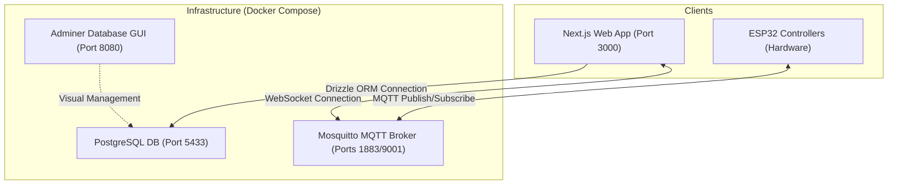

# E-LOCK System Operations Runbook

This runbook is the definitive guide for managing, maintaining, and troubleshooting the E-LOCK automated Lockout/Tagout (LOTO) system infrastructure.

<!-- AUTO-GENERATED:RUNBOOK_START -->

## 1. System Architecture & Services

The E-LOCK architecture is split into a **Web Dashboard**, an **Infrastructure Layer** (running in Docker), and **Firmware Nodes** (ESP32 controllers).



### Infrastructure Port Bindings
- **PostgreSQL Database:** Port `5433` (mapped from standard `5432` to avoid host conflicts)
- **MQTT TCP (Broker):** Port `1883`
- **MQTT WebSockets (Broker):** Port `9001`
- **Adminer Database GUI:** Port `8080` (accessible at `http://localhost:8080`)

---

## 2. Infrastructure Management (Docker)

All infrastructure components are orchestrated using Docker Compose.

### Start Infrastructure
Start all core database and message queue services in detached mode:
```bash
pnpm docker:up
```

### Check Container Status
Verify that containers are up and running, and check if the database is reported as `healthy`:
```bash
docker compose ps
```

### View Live Logs
View and follow container logs:
```bash
pnpm docker:logs
```

### Stop Infrastructure
Stop and remove containers without deleting persistent database volumes:
```bash
pnpm docker:down
```

### Safe Hard-Reset (Destructive)
Stop containers, clean up network resources, and **delete database/broker storage volumes**:
```bash
pnpm docker:reset
```
*Note: This command will clear all user profiles, locks, and history logs. Run `pnpm db:seed` immediately afterward to re-populate standard profiles.*

---

## 3. Database Maintenance & Operations

We use **Drizzle ORM** to manage the database schema defined in [schema.ts](file:///c:/projects/e-lock/web/src/drizzle/schema.ts).

### Schema Pushes (Development)
Directly apply `schema.ts` updates to the active local PostgreSQL database without migration files:
```bash
pnpm db:push
```

### Creating Schema Migrations (Production-ready)
Generate incremental SQL migration files when database tables undergo structural changes:
```bash
pnpm db:generate
```

### Running Pending Migrations
Apply generated migration files to the database:
```bash
pnpm db:migrate
```

### Seeding Mock Data
Populate default mock data (such as personnel accounts, registered locks, and mock events) for sandbox testing:
```bash
pnpm --filter @e-lock/web db:seed
```

### Visualizing Database Data
Drizzle Studio provides an interactive tabular view of the tables:
```bash
pnpm db:studio
```
Alternatively, open `http://localhost:8080` in a browser, select the `PostgreSQL` system, and fill in the credentials defined in [ENV.md](file:///c:/projects/e-lock/docs/ENV.md) to log in.

---

## 4. Health Checks & Monitoring

Continuous verification of services ensures minimal downtime and prevents procedural LOTO lockout delays.

### Database Health Check
PostgreSQL includes an Alpine `pg_isready` check configured in `docker-compose.yml`:
```yaml
healthcheck:
  test: ["CMD-SHELL", "pg_isready -U $$POSTGRES_USER -d $$POSTGRES_DB"]
  interval: 10s
  timeout: 5s
  retries: 5
```
You can inspect database health directly:
- Run `docker inspect elock-db --format "{{json .State.Health}}"`
- Confirm status equals `"healthy"`.

### MQTT Broker Health Check
Verify the MQTT broker is listening and accepting connections on port `1883` (TCP) and `9001` (WebSocket):
```bash
# Check if port 1883 is responsive
pnpm --filter @e-lock/web run dev
# (The web app log will output connection successes/failures)
```

---

## 5. Troubleshooting & Incident Mitigation

### A. Database Connection Failures
- **Symptom:** Web dashboard fails to load or throws database connection timed out warnings.
- **Troubleshoot Steps:**
  1. Ensure the docker containers are active using `docker ps`.
  2. Verify that host port `5433` is not blocked or bound by a local running instance of PostgreSQL. If it is, kill the local postgres process or change `DB_PORT` in your root `.env` and `DATABASE_URL` in `web/.env`.
  3. Ensure `.env` and `web/.env` database credentials match exactly.

### B. MQTT Broker Authentication Issues
- **Symptom:** ESP32 controllers disconnect immediately after connection, or web client fails to establish WebSocket subscription.
- **Troubleshoot Steps:**
  1. The MQTT broker automatically generates the hashed authentication file `passwd` from the `MQTT_USERNAME` and `MQTT_PASSWORD` defined in `.env` upon container start.
  2. If credentials are changed, execute a hard reset:
     ```bash
     pnpm docker:reset
     pnpm docker:up
     ```
  3. Verify that WebSocket protocol `ws://localhost:9001` is not blocked by client browser policies or local firewalls.

### C. PlatformIO Core Bootstrapping Crashes in Google Antigravity IDE
- **Symptom:** The PlatformIO sidebar fails to load or activates but crashes immediately inside the Antigravity IDE.
- **Troubleshoot Steps:**
  1. **Python Environment Issue:** Antigravity ships with Python 3.14, which breaks PlatformIO Core bootstrapping. Workaround: Force PlatformIO `penv` to use Python 3.11.
  2. **Extension ID Recognition:** Patch the PlatformIO extension's `extension.js` inside your IDE's extensions directory to explicitly whitelist the Antigravity product engine.
  3. Refer to [PLARFORM-IO-FIX-ANTIGRAVITY.md](file:///c:/projects/e-lock/docs/PLARFORM-IO-FIX-ANTIGRAVITY.md) for step-by-step patch codes.

---

## 6. Rollback & System Deactivation

If a bad deployment is detected, execute a rollback to the latest stable state:

1. **Stop Application Processes:**
   ```bash
   pnpm docker:down
   ```
2. **Revert Git State:**
   Revert to the last stable release or commit SHA:
   ```bash
   git checkout <stable-commit-sha>
   ```
3. **Re-initialize and Seed Database:**
   If the database schema changed during the failed version, perform a database reset and seed the schema clean:
   ```bash
   pnpm docker:reset
   pnpm docker:up
   pnpm db:push
   pnpm --filter @e-lock/web db:seed
   ```
4. **Re-start Services:**
   ```bash
   pnpm dev
   ```

<!-- AUTO-GENERATED:RUNBOOK_END -->
