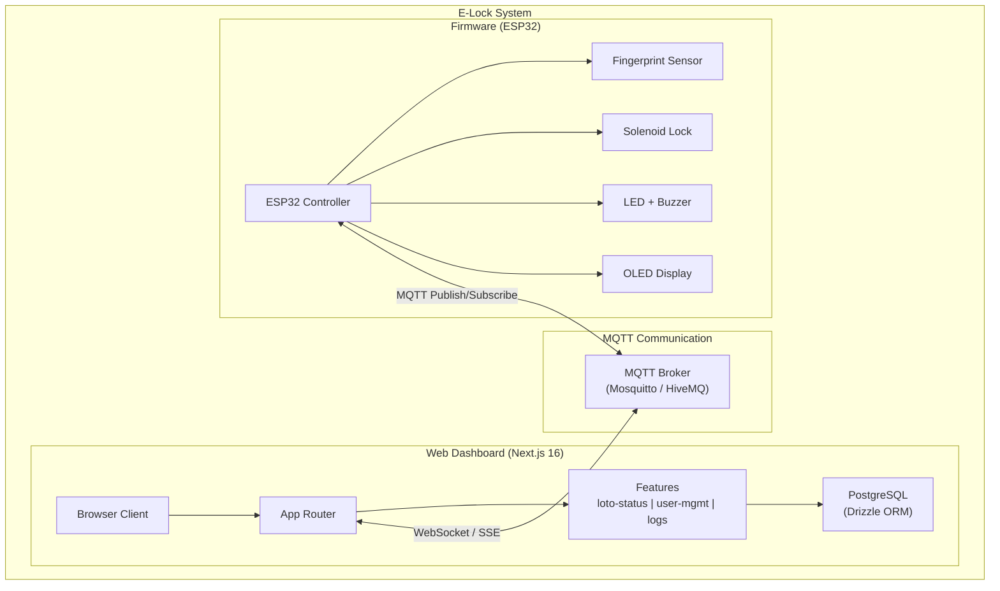

# System Architecture Overview

## High-Level Architecture

## Data Flow

1. **Authentication Flow:** Worker scans fingerprint → ESP32 verifies → Lock toggles → MQTT publishes event → Dashboard updates in real-time
2. **Remote Control Flow:** Admin sends command via Dashboard → MQTT broker → ESP32 receives → Lock toggles → Status published back
3. **Audit Trail:** Every lock/unlock event is published via MQTT and persisted to PostgreSQL with full metadata (timestamp, worker ID, machine ID, auth result)

## Communication Protocol

- **ESP32 ↔ Broker:** Standard MQTT (TCP port 1883)
- **Web ↔ Broker:** MQTT over WebSocket or server-side MQTT client relaying to SSE/WebSocket
- **Web ↔ Database:** Drizzle ORM over PostgreSQL (direct connection from server actions)
